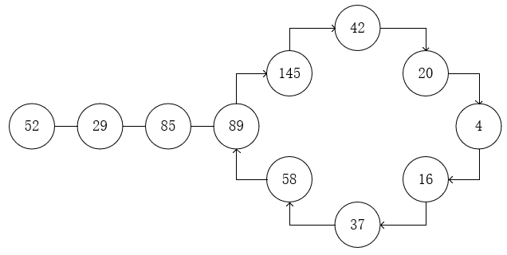

# 202.快乐数 —— 哈希表、数学

### 题目内容与要求

编写一个算法来判断一个数 n 是不是快乐数。

「快乐数」定义为：对于一个正整数，每一次将该数替换为它每个位置上的数字的平方和，然后重复这个过程直到这个数变为 1，也可能是 无限循环 但始终变不到 1。如果 可以变为  1，那么这个数就是快乐数。

如果 n 是快乐数就返回 True ；不是，则返回 False 。

示例：
```
输入：19
输出：true
解释：
12 + 92 = 82
82 + 22 = 68
62 + 82 = 100
12 + 02 + 02 = 1
```

> 来源：力扣（LeetCode）\
链接：https://leetcode-cn.com/problems/happy-number

### 题解

快乐数的计算是各位上数字的平方和，首先举几个例子



我们可以发现，当一个数字不是快乐数时，最终会陷入一个循环中，因为我们可以通过保存之前每一个生成的数判断是否进入的循环，若进入循环则表示该数字不是快乐数。

算法比较简单，通过 _while_ 循环判断是否已经等于1或新生成的数字是否已存在结果集中，若都不满足则继续计算。
