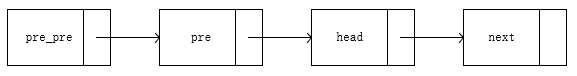
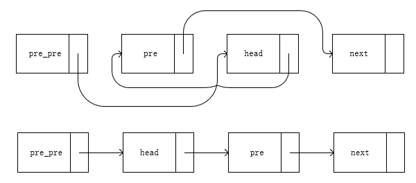

# 24.两两交换链表中的节点

### 题目内容与要求

给定一个链表，两两交换其中相邻的节点，并返回交换后的链表。

**你不能只是单纯的改变节点内部的值**，而是需要实际的进行节点交换。

示例:
```
给定 1->2->3->4, 你应该返回 2->1->4->3
```

> 来源：力扣（LeetCode）\
链接：https://leetcode-cn.com/problems/swap-nodes-in-pairs

### 题解

链表交换节点，本质就是解链与再链的过程，由于涉及前后两个节点的交换，两个节点各自前后各一个节点也会受影响，所以在每一次交换时就会涉及到四个节点，这四个节点都需要做好记录。



当需要进行交换时，首先是 _pre_pre_ 节点与 _pre_ 节点解链，链接 _head_ 节点；然后是 _pre_ 节点与 _head_ 节点解链，链接 _next_ 节点；最后是 _head_ 节点与 _next_ 节点解链，链接 _pre_ 节点，过程与结果图如下：



当每一次经过节点时，无论是否进行交换，都需要对除了 _next_ 以外三个节点进行更新（_next_ 节点会跟着 _head_ 自动更新）。此处又分两种情况：一是不交换节点，而是交换节点。

- 当不交换节点时，按照 _pre_pre_、_pre_、_head_ 的顺序依次向后更新即可，分别对应 _pre_、_head_、_head.next_
- 当交换节点时，_pre_pre_ 更新为已被交换至前面的 _head_，_head_ 更新为 _pre.next_，而 _pre_ 依然是下一个节点的pre，因此无须更新

在一开始我们通过新建一个链表链接给定的链表，当交换全部结束后，返回新链表.next即可。
